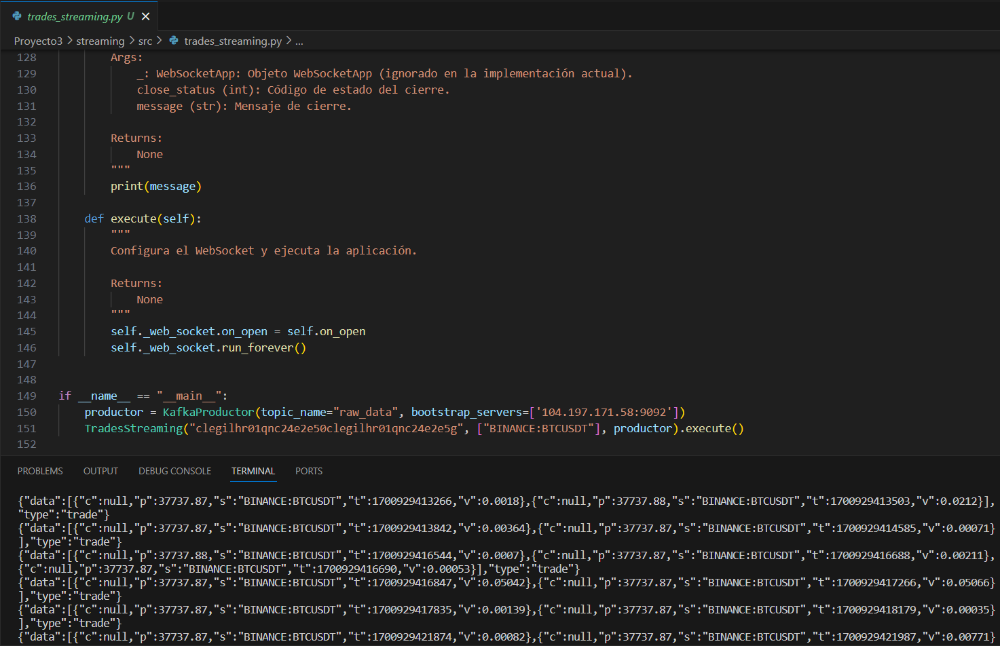
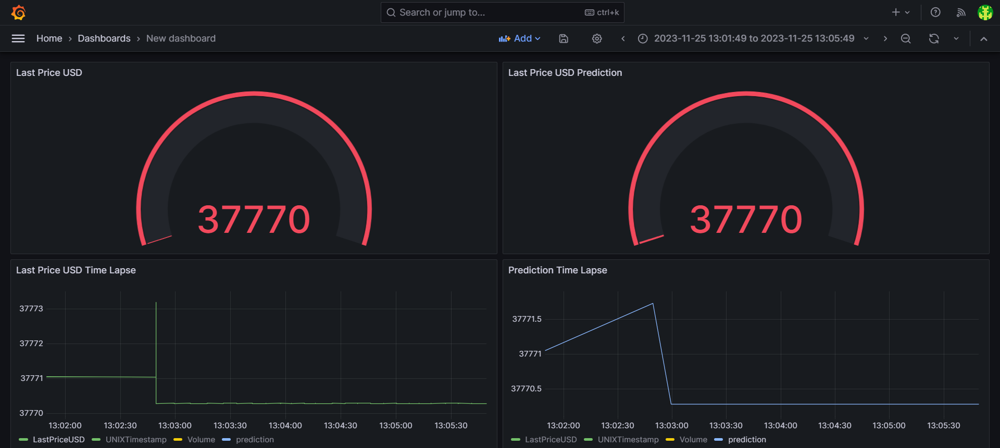

# ST02363 Tópicos Especiales en Telemática

# Estudiantes: Valentina Ochoa Arbooleda, vochoaa@eafit.edu.co
# Brigth Lorena Giraldo Vargas, blgiraldov@eafit.edu 
# Katherine Benjumena Ortiz, kbenjumeao@efit.edu.co

# Profesor: Edwin Nelson Montoya Munera, emontoya@eafit.edu.co

# Proyecto 3
# 1. breve descripción de la actividad
# Proyecto de streaming para la captura de datos en tiempo real.

El objetivo de este sistema es capturar datos en tiempo real provenientes del mercado de valores y procesarlos de manera eficiente y en tiempo real. La arquitectura está diseñada para integrar tecnologías clave, como Apache Kafka para la ingestión de datos en streaming, una base de datos NoSQL para el almacenamiento persistente, y un procesador de flujos para análisis en tiempo real de los datos financieros.

## 1.1. Que aspectos cumplió o desarrolló de la actividad propuesta por el profesor (requerimientos funcionales y no funcionales)

El proyecto ha logrado satisfacer los siguientes requisitos clave de manera exitosa: la captura de datos en tiempo real se ha implementado para asegurar la adquisición instantánea y continua de información relevante; se ha establecido un sistema eficiente para el traslado de datos a través de un canalizador; además la información capturada se almacena de manera óptima en una base de datos de mongo para un manejo eficaz y escalable.
Se ha desarrollado un mecanismo de procesamiento de flujo de datos que permite analizar la información dinámicamente en tiempo real; finalmente, se ha creado una interfaz de visualización en grafana Cloud que proporciona acceso inmediato a los resultados procesados, permitiendo la observación de estos datos en tiempo real.

## 1.2. Que aspectos NO cumplió o desarrolló de la actividad propuesta por el profesor (requerimientos funcionales y no funcionales)

Todos los aspectos para este proyecto fueron cumplidos. 

# 2. información general de diseño de alto nivel, arquitectura, patrones, mejores prácticas utilizadas.

El proyecto sigue una arquitectura de streaming de datos desde el servidor WebSocket de Finnhub hacia Apache Kafka, utilizando un script Python llamado TradesStreaming. Este script se conecta al servidor WebSocket, suscribe símbolos y envía las actualizaciones en tiempo real al tema "raw_data" en Kafka. Desde Kafka, los datos pueden ser consumidos por otros procesadores en tiempo real para análisis y también son almacenados de forma persistente en MongoDB para su posterior consulta y análisis retrospectivo. El proyecto prioriza la escalabilidad, durabilidad y flexibilidad en el análisis de datos financieros provenientes del mercado de valores

# 3. Descripción del ambiente de desarrollo y técnico: lenguaje de programación, librerias, paquetes, etc, con sus numeros de versiones.

Se realizó en GCP, utilizando databricks para realizar el pipeline que consume de apache Kafka.

Se utilizaron archivos yaml
1. Kafka.yaml  Este archivo define los servicios de Docker para ejecutar Kafka y Zookeeper. Se utiliza la imagen oficial de Confluent para Kafka y Zookeeper. Se especifican los puertos expuestos y las configuraciones necesarias para la comunicación entre Kafka y Zookeeper.

2. MongoDb.yaml Este archivo de configuración Docker establece el servicio de MongoDB. Se utiliza la imagen oficial de MongoDB con la versión 3.8. Se especifican las credenciales de inicio de sesión y se mapean los puertos para la comunicación con la base de datos.

Se utilizó pyhton con las siguientes librerías:

asttokens==2.4.1
certifi==2023.11.17
charset-normalizer==3.3.2
colorama==0.4.6
comm==0.2.0
debugpy==1.8.0
decorator==5.1.1
executing==2.0.1
finnhub-python==2.4.19
idna==3.4
ipykernel==6.26.0
ipython==8.17.2
jedi==0.19.1
jupyter_client==8.6.0
jupyter_core==5.5.0
kafka-python==2.0.2
matplotlib-inline==0.1.6
nest-asyncio==1.5.8
packaging==23.2
parso==0.8.3
platformdirs==4.0.0
prompt-toolkit==3.0.41
psutil==5.9.6
pure-eval==0.2.2
Pygments==2.17.0
python-dateutil==2.8.2
pywin32==306
pyzmq==25.1.1
requests==2.31.0
six==1.16.0
stack-data==0.6.3
tornado==6.3.3
traitlets==5.13.0
urllib3==2.1.0
wcwidth==0.2.10
websocket-client==1.6.4

Se utilizó MongoDB para la base de datos.

## como se compila y ejecuta.

Se deben instalar las dependencias que se encuentran en el archivo requeriments.txt.
Se debe de clonar el repositorio.
Para compilar y ejecutar el proyecto, primero, se debe inicia el productor Python (kafka_productor.py) para capturar datos localmente. se debe asegurar de que los contenedores de la base de datos MongoDB y Kafka estén en ejecución en la máquina virtual. Después, ejecuta la instancia del script streaming.py para transferir los datos locales al sistema Kafka, creando así un flujo continuo de información en tiempo real.

Luego, despliega un entorno de Databricks y asegúrate de que la máquina virtual esté en funcionamiento. Ejecuta el cuaderno streaming_kafka.ipynb en Databricks para consumir y procesar los datos desde el flujo de Kafka. La conexión a la base de datos MongoDB se realiza automáticamente, y las predicciones se generan utilizando el modelo de regresión lineal.

Finalmente, para visualizar los datos en tiempo real,  se ingresa a Grafana Cloud, donde se pueden crear paneles interactivos utilizando diferentes tipos de gráficos y consultas variadas, además de las realizadas previamente (al final del documento se encuentra una imagen del tablero de Grefana con 4 gráficas listas.)

## detalles del desarrollo.

El proyecto se desarrolla en un entorno PySpark utilizando el archivo streaming_kafka.ipynb. En este cuaderno, se configura la conexión con una base de datos MongoDB y se establece la estructura de datos, definiendo un esquema que incluye información crucial como condiciones de operación, precio, símbolo, marca de tiempo y volumen. La lógica de captura de datos en tiempo real se realiza mediante la lectura de un flujo Kafka, donde se utilizan funciones de PySpark para transformar y seleccionar los datos relevantes. El componente de predicción se implementa con un modelo de regresión lineal, aprovechando la biblioteca MLlib de PySpark. El resultado se visualiza en tiempo real y se almacena en una base de datos NoSQL MongoDB. La configuración del entorno Kafka se especifica en el archivo kafka.yaml, mientras que mongoDB.yaml detalla la configuración del servicio MongoDB. Adicionalmente, se encuentra un productor de Kafka (kafka_productor.py) que permite enviar mensajes al tema "raw_data", alimentando así el flujo de datos. El componente de streaming (streaming.py) utiliza WebSocket para recibir datos en tiempo real y, mediante un productor Kafka, envía mensajes al tema mencionado para su procesamiento posterior en Spark. 

## descripción y como se configura los parámetros del proyecto (ej: ip, puertos, conexión a bases de datos, variables de ambiente, parámetros, etc)

Ip: 104.197.171.58::27017 -> Base de datos
Ip:  104.197.171.58::9092-> Apache Kafka 

## opcionalmente - si quiere mostrar resultados o pantallazos

tablero de grafana Cloud con gráficas en tiempo real

# referencias:

## https://learn.microsoft.com/es-es/windows/win32/directshow/about-the-multimedia-streaming-architecture
## https://kafka.apache.org/
## https://avi-soori.medium.com/databricks-automl-sql-streaming-ml-on-the-lakehouse-6ea1aa1fcd18
## https://docs.databricks.com/en/structured-streaming/index.html

#### versión README.md -> 1.0 (2023-Noviembre)
