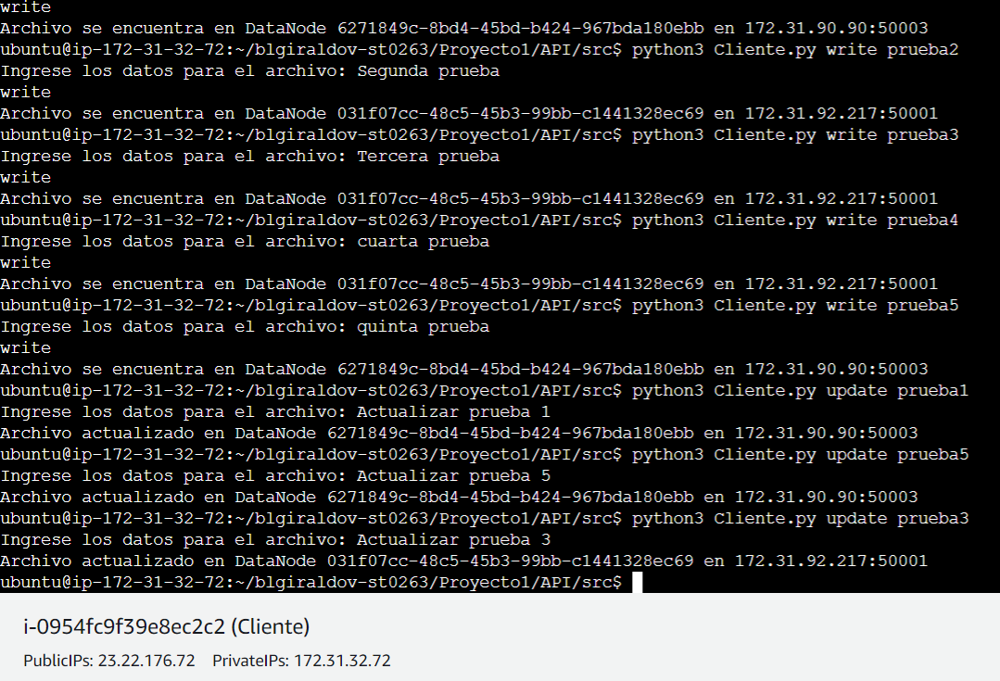

# ST02363 Tópicos Especiales en Telemática

# Estudiantes: 
# Katherine Benjumea Ortiz, kbenjumeao@eafit.edu.co
# Brigith Lorena Giraldo Vargas, blgiraldov@eafit.edu.co
# Valentina Ochoa Arboleda, vochoaa@eafit.edu.co

# Profesor: Edwin Nelson Montoya Munera, emontoya@eafit.edu.co

# nombre del proyecto, lab o actividad

Proyecto 1. DFS

#
# 1. breve descripción de la actividad
#
Diseño e implementación de un sistema de archivos distribuidos minimalista como un Almacenamiento por Objetos, con un servidor NameNode que gestiona la ubicación de los archivos y registra los DataNodes disponibles,los cuales se encargan de almacenar los archivos en el sistema. Cada DataNode es responsable de gestionar y almacenar los archivos que se le asignan.

## 1.1. Que aspectos cumplió o desarrolló de la actividad propuesta por el profesor (requerimientos funcionales y no funcionales)

1. Implementación de un cliente CLI/API REST(POSTMAN)
2. Implementación de un servidor NameNode que se comunica con el cliente para devolver ubicación de un archivo solicitado por el cliente.
2. Implementación de un servidor DataNode que se encarga de almacenar los archivos suministrados por el cliente.
3. Replicación de los archivos en los DataNode (DataNode lider y DataNode seguidor)

## 1.2. Que aspectos NO cumplió o desarrolló de la actividad propuesta por el profesor (requerimientos funcionales y no funcionales)

No se logró cumplir con la implementación de la replicación del NameNode.

# 2. información general de diseño de alto nivel, arquitectura, patrones, mejores prácticas utilizadas.

Se tienen 6 instancias fundamentales para el desarrollo y la arquitectura del proyecto:

1. Server DataNode1.
2. Server DataNode2.
3. Server DataNode3.
4. Server DataNode4.
5. Server NameNode.
6. Cliente.

Arquitecuta: Para el proyecto se tiene una arquitectura híbrida que combina elementos de cliente-servidor y peer-to-peer para implementar un sistema de archivos distribuidos, esta arquitectura combina la centralización del NameNode para llevar un registro de la ubicación de los archivos y la descentralización de los DataNodes para el almacenamiento físico de los archivos. El enfoque peer-to-peer se refleja en la distribución de los DataNodes, cada uno con su propio almacenamiento, mientras que el servidor NameNode actúa como un punto centralizado de coordinación.

# 3. Descripción del ambiente de desarrollo y técnico: lenguaje de programación, librerias, paquetes, etc, con sus numeros de versiones.

## como se compila y ejecuta.

Para la ejecución de este proyecto se necesitan las siguientes librerias:
Python
Flask
Grpc

para instalar, ejecute los siguientes comandos:

sudo apt-get install python3
sudo apt install python3-pip
pip install grpcio
pip install grpcio-tools
pip3 install flask

Luego puede probar el proyecto ingresando a POSTMAN de la siguiente manera: 

Y por consola de la siguiente manera:

## descripción y como se configura los parámetros del proyecto (ej: ip, puertos, conexión a bases de datos, variables de ambiente, parámetros, etc)

En primer lugar se comenzo creando 6 máquinas virtuales (Server DataNode1, Server DataNode2, Server DataNode3, Server DataNode4, Server NameNode, Cliente), todas con el mismo sistema operativo (Ubuntu 22.04 LTS). 

- Para todas las máquinas se activan las conexiones por *http* y *https*. 

## opcional - detalles de la organización del código por carpetas o descripción de algún archivo. (ESTRUCTURA DE DIRECTORIOS Y ARCHIVOS IMPORTANTE DEL PROYECTO, comando 'tree' de linux)

# 4. Descripción del ambiente de EJECUCIÓN (en producción) lenguaje de programación, librerias, paquetes, etc, con sus numeros de versiones.

El proyecto se realizo en 6 máquinas virtuales:

1. Server DataNode1.

2. Server DataNode2.

3. Server DataNode3.

4. Server DataNode4.

5. Server NameNode.

6. Cliente. 

Se usaron las siguientes librerias:

Python 3.10.12
Flask 3.0.0
Werkzeug 3.0.0
libprotoc 24.3

## Como se lanza el servidor.

1. Se inicializan las máquinas.
2. Entra por el navegador, por postman o por consola a la Ip elástica del NameNode.
3. Se pueden verificar las peticiones hechas por el cliente.

## opcionalmente - si quiere mostrar resultados o pantallazos 

Por consola: se debe enviar que petición quiere hacer 
Ejemplo: Cliente.py write prueba1

Registro
Se hace el registro de los DataNodes que serán utilizados

Write

Read

Update

Por postman:

# 5. otra información que considere relevante para esta actividad.

# referencias:

## https://www.linkedin.com/pulse/namenode-server-hdfs-babak-rezaei-bastani
## https://docs.cloudera.com/runtime/7.2.0/hdfs-overview/topics/hdfs-datanodes-intro.html
## https://grpc.io/

#### versión README.md -> 1.0 (2023-Octubre)