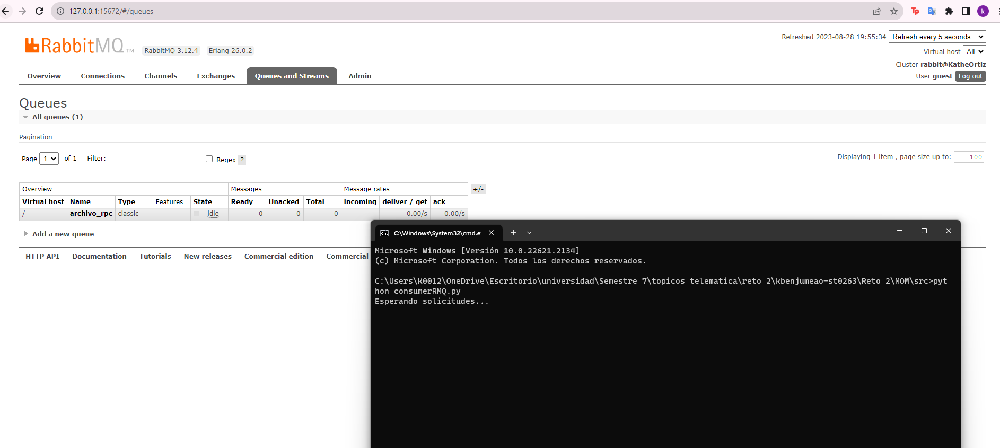
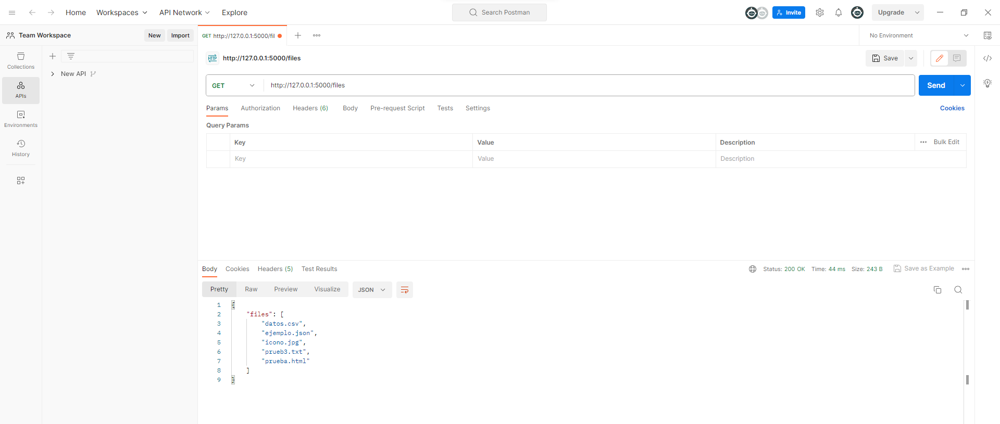
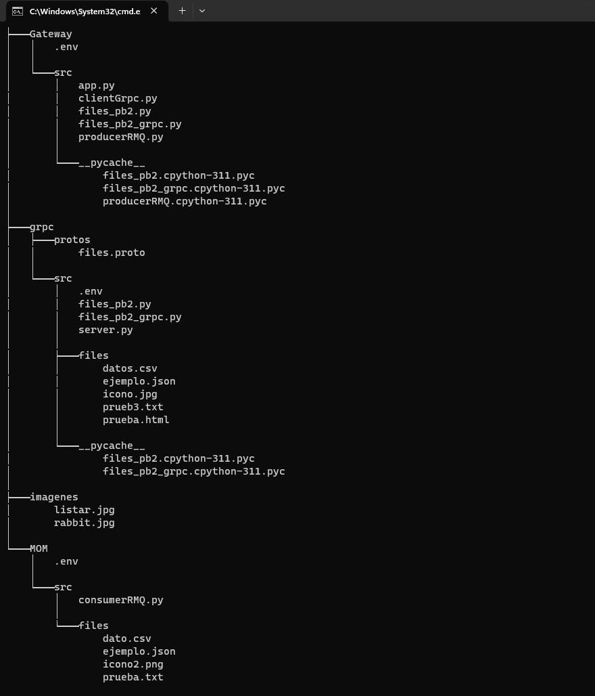

# ST0263 Tópicos Especiales en Telemática

# Estudiante: Katherine Benjumea Ortiz, kbenjumeao@eafit.edu.co

# Profesor: Edwin Nelson Montoya Munera, emontoya@eafit.edu.co

# Reto 2

# 1. breve descripción de la actividad
Para este reto, se implementó lo siguiente:

- **Microservicio 1:** Este es encargado de listar archivos a través de gRPC. Tiene comunicación con el API Gateway.

- **Microservicio API Gateway:** Este es encargado de funcionar como gateway y también como un balanceador de cargas y proxy.

## 1.1. Qué aspectos cumplió o desarrolló de la actividad propuesta por el profesor (requerimientos funcionales y no funcionales)

- Implementación microservicio 1.
- Comunicación vía gRPC para el microservicio 1.
- Implementación microservicio API Gateway.
- Comunicación API Rest entre cliente y API Gateway.
- Archivos de configuración .env.
- Implementación de endpoints para listar archivos.

## 1.2. Que aspectos NO cumplió o desarrolló de la actividad propuesta por el profesor (requerimientos funcionales y no funcionales)

Se hizo el intento de implementar el microservicio 2 que es el encargado de buscar los archivos a traves de RabbitMQ, pero no se logra establecer conexión para su adecuado funcionamiento. 
No se logró dockerizar por diversos problemas presentados en el ambiente de desarrollo.

# 2. información general de diseño de alto nivel, arquitectura, patrones, mejores prácticas utilizadas.

En la arquitectura del proyecto se observan 2 componentes en el desarrollo de este mismo, se describen a continuación:

1. API Gateway.
2. Microservicio 1 con Grpc

- Se utiliza Python como lenguaje de programación.

En el proyecto un cliente puede hacer una petición mediante su navegador web, o mediante desde Postman. Éste se comunica mediante el API Rest. El API Gateway a su vez se comunica mediante gRPC con el primer microservicio, el cual tiene la función de listar los archivos disponibles. El microservicio de buscar un archivo se buscó ser implementado con MOM a través de RabbitMQ. Luego de varias pruebas no se logra establecer comunicación. Se crea la cola en la interfaz al ejecutar y correr el consumidor, pero no logra entrar el query enviado. 

# 3. Descripción del ambiente de desarrollo y técnico: lenguaje de programación, librerias, paquetes, etc, con sus numeros de versiones.

Todos los servicios fueron implementados con Python 3.11.4.
Flask se utilizó para implementar la puerta de enlace API.
Grpcio es una biblioteca del kit de herramientas gRPC para implementar el microservicio 1 de listar los archivos.
Pika es la biblioteca de cliente RabbitMQ para el intento de implementación del microservicio 2.
Protobuf se usó para almacenar los datos estructurados y para la comunicacion de c/s describiendo la interfaz.
Dotenv se usó para asignar variables a valores y que no sean vistos estos valores. 

    Flask==2.3.3
    grpcio==1.57.0
    grpcio-tools==1.57.0
    pika==1.3.2
    protobuf==4.24.1
    python-dotenv==1.0.0

## como se compila y ejecuta.

- Se debe clonar el repositorio: git clone https://github.com/Katherine-Ortiz/kbenjumeao-st0263.git
- Después se ejecuta y corre el servidor, para esto se ingresa a la siguiente ruta: Reto2/Grpc/src y se ejecuta el comando python server.py
- Luego se debe correr el api, para esto se ingresa a la siguiente ruta: Reto2/Gateway/src y se ejecuta el comando python app.py
- Por último se accede a la dirección http://127.0.0.1:5000/files
- Así el cliente puede observar la lista de archivos. En postman funciona de la misma manera y al ejecutar se obtiene lo siguiente: 

## descripción y como se configura los parámetros del proyecto (ej: ip, puertos, conexión a bases de datos, variables de ambiente, parámetros, etc)

Cada microservicio cuenta con su archivo .env donde se encuentra la configuración de estos mismos.

## opcional - detalles de la organización del código por carpetas o descripción de algún archivo. (ESTRUCTURA DE DIRECTORIOS Y ARCHIVOS IMPORTANTE DEL PROYECTO, comando 'tree' de linux)

# Link video:
https://eafit-my.sharepoint.com/:v:/g/personal/kbenjumeao_eafit_edu_co/EZh3_GJYv-JMo4JG1KgLFV4BdcT1wEmlLnLEVez0ty_Y4w?e=ALLI6s&nav=eyJyZWZlcnJhbEluZm8iOnsicmVmZXJyYWxBcHAiOiJTdHJlYW1XZWJBcHAiLCJyZWZlcnJhbFZpZXciOiJTaGFyZURpYWxvZyIsInJlZmVycmFsQXBwUGxhdGZvcm0iOiJXZWIiLCJyZWZlcnJhbE1vZGUiOiJ2aWV3In19

# referencias:

- https://www.rabbitmq.com/documentation.html 
- https://www.topcoder.com/thrive/articles/build-microservice-architecture-msa-rest-api-using-the-using-flask
- https://grpc.io/docs/languages/python/quickstart/
- https://github.com/st0263eafit/st0263-232/tree/main/Laboratorio-RPC

