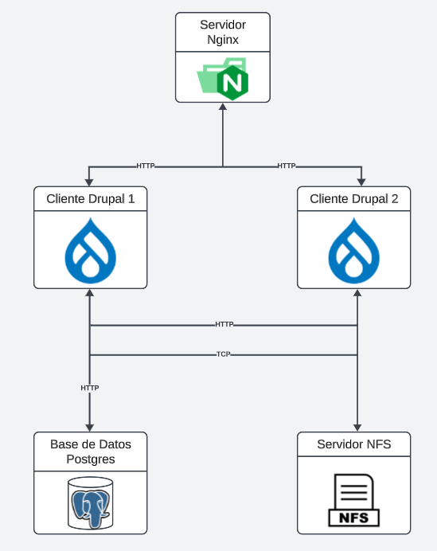

# ST02363 Tópicos Especiales en Telemática

# Estudiante: Katherine Benjumea Ortiz, kbenjumeao@eafit.edu.co

# Profesor: Edwin Nelson Montoya Munera, emontoya@eafit.edu.co

# nombre del proyecto, lab o actividad
#
# 1. breve descripción de la actividad
#
Desplegar dos máquinas virtuales de drupal empleando contenedores. Se usa Nginx como balanceador de cargas, dos servidores adicionales tanto para la base de datos (Postgres) como para el manejo de la replicacion de datos (con NFS-SERVER).

## 1.1. Que aspectos cumplió o desarrolló de la actividad propuesta por el profesor (requerimientos funcionales y no funcionales)

1. Aplicación Drupal 1 dockerizada monolítica en varios nodos que mejore la disponibilidad de esta aplicación.
2. Aplicación Drupal 2 dockerizada monolítica en varios nodos que mejore la disponibilidad de esta aplicación.
2. Implementación de un balanceador de cargas basado en nginx.
3. Tener 2 instancias de procesamiento wordpress detrás del balanceador de cargas.
4. Tener 1 instancia de bases de datos postgres.
5. Tener 1 instancia de archivos distribuidos en NFS.

## 1.2. Que aspectos NO cumplió o desarrolló de la actividad propuesta por el profesor (requerimientos funcionales y no funcionales)

Se cumplió con todo lo necesario del reto 3.

# 2. información general de diseño de alto nivel, arquitectura, patrones, mejores prácticas utilizadas.

# 3. Descripción del ambiente de desarrollo y técnico: lenguaje de programación, librerias, paquetes, etc, con sus numeros de versiones.

## como se compila y ejecuta.
## detalles del desarrollo.
## detalles técnicos
## descripción y como se configura los parámetros del proyecto (ej: ip, puertos, conexión a bases de datos, variables de ambiente, parámetros, etc)
## opcional - detalles de la organización del código por carpetas o descripción de algún archivo. (ESTRUCTURA DE DIRECTORIOS Y ARCHIVOS IMPORTANTE DEL PROYECTO, comando 'tree' de linux)
## 
## opcionalmente - si quiere mostrar resultados o pantallazos 

# 4. Descripción del ambiente de EJECUCIÓN (en producción) lenguaje de programación, librerias, paquetes, etc, con sus numeros de versiones.

# IP o nombres de dominio en nube o en la máquina servidor.

## descripción y como se configura los parámetros del proyecto (ej: ip, puertos, conexión a bases de datos, variables de ambiente, parámetros, etc)

## como se lanza el servidor.

## una mini guia de como un usuario utilizaría el software o la aplicación

## opcionalmente - si quiere mostrar resultados o pantallazos 

# 5. otra información que considere relevante para esta actividad.

# referencias:
<debemos siempre reconocer los créditos de partes del código que reutilizaremos, así como referencias a youtube, o referencias bibliográficas utilizadas para desarrollar el proyecto o la actividad>
## sitio1-url 
## sitio2-url
## url de donde tomo info para desarrollar este proyecto

#### versión README.md -> 1.0 (2022-agosto)